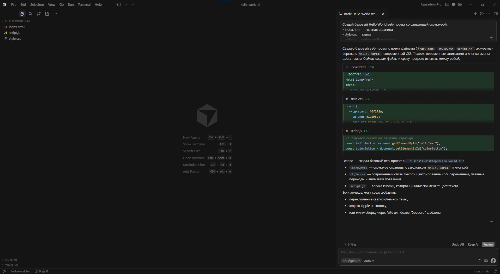
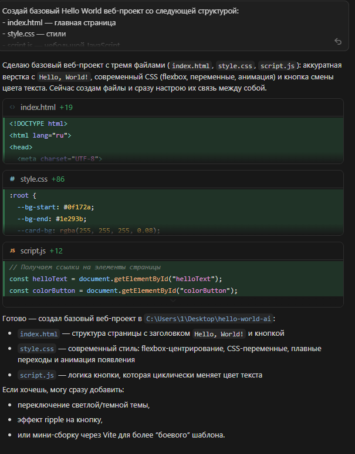
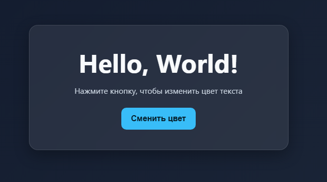
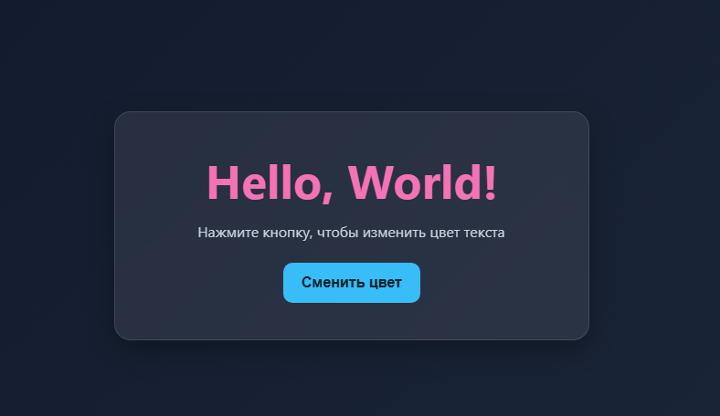
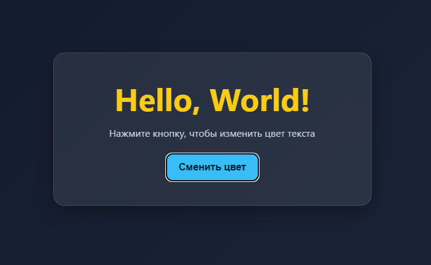

# 🛠️ Практический раздел: Hello World в Cursor

> Создание базового проекта с помощью AI-агента Cursor

---

## Почему Cursor?

Для практической демонстрации выбран **Cursor** как наиболее функциональный и распространённый инструмент среди Standalone IDE-агентов. Обоснование выбора изложено в [разделе выводов](CONCLUSION.md).

Мы создадим простой веб-проект «Hello World» — HTML-страницу с CSS и JavaScript — полностью через диалог с AI-агентом, без написания кода вручную.

---

## Установка и настройка Cursor

### Шаг 1: Скачать и установить

1. Перейдите на [cursor.com](https://cursor.com)
2. Нажмите **Download** — Cursor автоматически определит вашу ОС (Windows / macOS / Linux)
3. Установите приложение стандартным способом

### Шаг 2: Первый запуск

При первом запуске Cursor предложит:
- **Импортировать настройки из VS Code** — рекомендуется, если работали в VS Code
- Выбрать тему оформления
- **Авторизоваться** — создайте аккаунт на cursor.com (бесплатный тариф доступен сразу)

### Шаг 3: Ориентация в интерфейсе



**Основные горячие клавиши:**

| Команда | Действие |
|---------|----------|
| `Cmd/Ctrl + L` | Открыть AI Chat |
| `Cmd/Ctrl + K` | Inline редактирование выделенного кода |
| `Cmd/Ctrl + I` | Открыть Composer (агентный режим) |
| `Tab` | Принять автодополнение |

---

## Создание проекта Hello World

### Этап 1: Открыть папку проекта

1. Откройте Cursor
2. **File → Open Folder**
3. Создайте новую папку `hello-world-ai` и откройте её
4. Откройте терминал: `` Ctrl + ` ``

### Этап 2: Запрос к AI-агенту через Composer

Нажмите `Cmd/Ctrl + I` для открытия **Composer** (агентный режим).

Введите следующий промпт:

```
Создай базовый Hello World веб-проект со следующей структурой:
- index.html — главная страница
- style.css — стили
- script.js — небольшой JavaScript

Требования:
1. Страница должна отображать "Hello, World!" с красивым оформлением
2. Добавь кнопку, при нажатии на которую текст меняет цвет
3. Используй современный CSS (flexbox, переменные, анимации)
4. Код должен быть чистым и прокомментированным
```

### Этап 3: Агент создаёт проект

Cursor Composer начнёт работу и вы увидите:



Агент создаст все три файла автоматически. Ниже — пример того, что будет сгенерировано.

---

### Результат: Сгенерированные файлы

#### `index.html`
```html
<!DOCTYPE html>
<html lang="ru">
<head>
  <meta charset="UTF-8">
  <meta name="viewport" content="width=device-width, initial-scale=1.0">
  <title>Hello World</title>
  <link rel="stylesheet" href="style.css">
</head>
<body>
  <main class="container">
    <section class="card">
      <h1 id="helloText">Hello, World!</h1>
      <p class="subtitle">Нажмите кнопку, чтобы изменить цвет текста</p>
      <button id="colorButton" type="button">Сменить цвет</button>
    </section>
  </main>

  <script src="script.js"></script>
</body>
</html>

```

#### `style.css`
```css
:root {
  --bg-start: #0f172a;
  --bg-end: #1e293b;
  --card-bg: rgba(255, 255, 255, 0.08);
  --text-main: #f8fafc;
  --text-muted: #cbd5e1;
  --accent: #38bdf8;
  --accent-hover: #0ea5e9;
  --shadow: 0 10px 30px rgba(0, 0, 0, 0.3);
}

* {
  box-sizing: border-box;
  margin: 0;
  padding: 0;
}

body {
  min-height: 100vh;
  font-family: "Segoe UI", Tahoma, Geneva, Verdana, sans-serif;
  color: var(--text-main);
  background: linear-gradient(135deg, var(--bg-start), var(--bg-end));
}

.container {
  /* Центрируем карточку по горизонтали и вертикали с помощью flexbox */
  min-height: 100vh;
  display: flex;
  align-items: center;
  justify-content: center;
  padding: 1.5rem;
}

.card {
  width: min(100%, 520px);
  text-align: center;
  background: var(--card-bg);
  border: 1px solid rgba(255, 255, 255, 0.12);
  border-radius: 18px;
  padding: 2.5rem 2rem;
  box-shadow: var(--shadow);
  backdrop-filter: blur(10px);
  animation: fade-up 650ms ease-out;
}

h1 {
  font-size: clamp(2rem, 6vw, 3.2rem);
  margin-bottom: 0.75rem;
  transition: color 280ms ease;
}

.subtitle {
  color: var(--text-muted);
  margin-bottom: 1.5rem;
}

button {
  border: none;
  border-radius: 10px;
  padding: 0.8rem 1.25rem;
  font-size: 1rem;
  font-weight: 600;
  color: #06202c;
  background: var(--accent);
  cursor: pointer;
  transition: transform 180ms ease, background-color 180ms ease;
}

button:hover {
  background: var(--accent-hover);
  transform: translateY(-2px);
}

button:active {
  transform: translateY(0);
}

@keyframes fade-up {
  from {
    opacity: 0;
    transform: translateY(16px);
  }
  to {
    opacity: 1;
    transform: translateY(0);
  }
}

```

#### `script.js`
```javascript
// Получаем ссылки на элементы страницы
const helloText = document.getElementById("helloText");
const colorButton = document.getElementById("colorButton");

// Набор цветов, между которыми будет переключаться текст
const colors = ["#f8fafc", "#f472b6", "#22d3ee", "#facc15", "#34d399"];
let currentColorIndex = 0;

// Меняем цвет текста по кругу при каждом клике
colorButton.addEventListener("click", () => {
  currentColorIndex = (currentColorIndex + 1) % colors.length;
  helloText.style.color = colors[currentColorIndex];
});

```

---

### Этап 4: Запуск проекта

**Открыть напрямую в браузере:**
```bash
open index.html        # macOS
start index.html       # Windows
xdg-open index.html    # Linux
```

**Или через Live Server** (расширение совместимо с Cursor как с VS Code):
1. Правая кнопка на `index.html` → **Open with Live Server**
2. Браузер откроет `localhost:5500`
   
# Готовый Hello, world! ("Hello, world!" меняет цвета по нажатию кнопки)
Пример 1:


Пример 2:


Пример 3:


---

## Ключевые наблюдения

**Что Cursor сделал агентно:**

1. Создал все три файла сразу — не спрашивал «а теперь CSS?», сам понял структуру и создал проект целиком
2. Код соответствует современным практикам: CSS-переменные, flexbox, семантический HTML
3. Выполнил требование о комментариях из промпта
4. При дальнейших итерациях помнит контекст и добавляет изменения согласованно

**Ограничения бесплатного тарифа:**
- После 50 premium-запросов скорость снижается (используются менее мощные модели)
- 2 000 автодополнений в месяц достаточно для учебных проектов

---

## Итог

За несколько минут и без ручного написания кода получили:
- ✅ Структуру проекта (3 файла)
- ✅ Современный HTML с семантической разметкой
- ✅ CSS с переменными, flexbox и анимациями
- ✅ Интерактивный JavaScript
- ✅ Прокомментированный, читаемый код

Cursor наглядно демонстрирует агентный подход: понял задачу целиком, самостоятельно декомпозировал на файлы и создал согласованный результат.

---

*← [Сравнительная таблица](COMPARISON_TABLE.md) | [Выводы →](CONCLUSION.md)*
